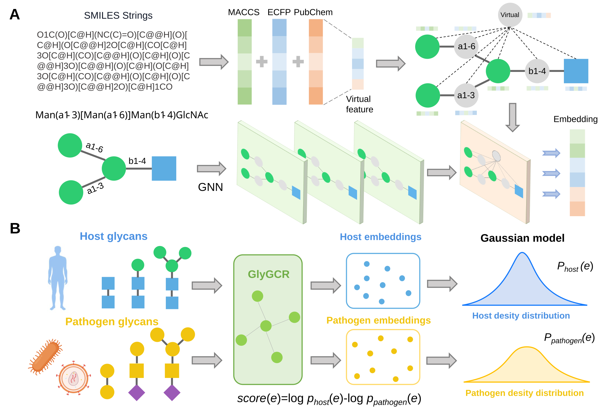

<div align="center">

# GlyCGR: Chemistry-aware Glycan Representations

*Learning informative representations of glycans by jointly encoding glycan graph topology and molecular fingerprints.*

</div>

<p align="center">
  
</p>

## Overview

Glycans are branched carbohydrate structures whose biological function is jointly determined by
their **connectivity/topology** (which monosaccharides link to which, and how) and their
**local chemical environment** (functional groups, stereochemistry). **GlyCGR** learns glycan
embeddings by fusing two complementary views of the same molecule:

- a **topological view**, in which the glycan is treated as a graph of monosaccharide/linkage
  nodes and encoded with a graph neural network, and
- a **fingerprint view**, in which the glycan is converted to SMILES and described by classical
  molecular fingerprints.

The resulting embeddings support taxonomic and immunogenicity classification. A separate
dual-reference density analysis places a glycan on a signed scale from
**immunogenic-pathogen-like (negative)** to **host-like (positive)**.

## Highlights

- **Dual-view fusion** of glycan graph topology (T) and molecular fingerprints (FP).
- **Three architecture controls**: GlyCGR-T (graph only), GlyCGR-TC (late concatenation),
  and GlyCGR-FF (virtual-node interaction at every layer).
- **Three fingerprint families** (MACCS, Morgan/ECFP, PubChem) with optional chirality encoding.
- **Host-likeness scoring** from the log density ratio of two reference populations.
- **Interactive web visualizations** of the learned embedding space (Plotly), included as
  self-contained HTML pages.

---

## Repository structure

```
GlyCGR-master/
├── proprecess/                 # Sequence and fingerprint preprocessing
├── model/                      # GlyCGR encoders and reference-density model
├── data/                       # Model input data; MPM-fingerprint.csv uses Git LFS
├── eval/
│   ├── benchmark_glycgr_raw.py       # GlyCGR benchmark
│   ├── benchmark_glycgr_ablations.py # GlyCGR-T / -TC / -FF benchmarks
│   └── data/                   # Evaluation data, including immunogenicity splits
├── output/                     # Saved embeddings and scores
├── weights/                    # Saved model weights
├── MD/                         # Structures and docking configuration files
└── 图片1.svg                   # Overview figure
```

---

## Pipeline

### 1 · Preprocessing (`proprecess/`)

| Script | Role |
| ------ | ---- |
| **`smiles.py`** | Batch-converts glycan sequences into **SMILES** strings using [`glyles`](https://github.com/kalininalab/GlyLES). Reads a target column from a CSV and writes a new `smiles` column. |
| **`fingerprint.py`** | Generates **three fingerprints** from each SMILES — **MACCS keys**, **Morgan / ECFP** (configurable radius and bit length, with an optional **chirality** flag `useChirality`), and **PubChem** fingerprints — and concatenates them into a single feature vector. |
| **`sigmod_risk.py`** | Optionally maps the signed raw score to **[-1, 1]** with a sigmoid transform; the evaluation scripts report raw scores when applicable. |

### 2 · Models (`model/`)

| Model | Description |
| ----- | ----------- |
| **GlyCGR** | Main encoder: graph topology and a projected molecular fingerprint meet through a virtual node in the fourth graph layer. |
| **GlyCGR-T** | Evaluation control using only graph topology, without fingerprints or a virtual node. |
| **GlyCGR-TC** | Evaluation control concatenating the graph readout and projected fingerprint before classification. |
| **GlyCGR-FF** | Evaluation control connecting the fingerprint virtual node during all four graph layers. |

### 3 · Evaluation (`eval/`)

The scripts in `eval/` are **tests of model performance** on the supplied
classification and immunogenicity datasets. They use each CSV's existing
`train`/`valid`/`test` split, keep duplicate rows and rare classes, select
the best epoch on validation data, and evaluate the test split once per seed.
The eight taxonomy levels use `data/MPM-fingerprint.csv`; the binary task uses
`eval/data/fingerprint-immunogenicity.csv`.

| Script | Model(s) and default settings |
| ------ | ----------------------------- |
| `benchmark_glycgr_raw.py` | GlyCGR; five seeds (0–4); AdamW, learning rate `1e-3`, weight decay `1e-4`, cosine `T_max=100`, 100 epochs, batch size 64. |
| `benchmark_glycgr_ablations.py` | GlyCGR-T, GlyCGR-TC and GlyCGR-FF; three seeds (0–2), 100 epochs, batch size 32; each architecture retains its recorded optimizer and learning-rate schedule (`T_max=50`). |

Validation Macro-F1 selects the taxonomy checkpoint; validation AUPRC selects
the immunogenicity checkpoint. Results include per-seed metrics, sample
standard deviations, training histories, and row-level predictions.

```bash
# Run from the repository root. These two commands inspect the data without training.
python eval/benchmark_glycgr_raw.py --check-data
python eval/benchmark_glycgr_ablations.py --check-data

# Full benchmarks; each run writes to a new timestamped directory under eval/.
python eval/benchmark_glycgr_raw.py
python eval/benchmark_glycgr_ablations.py
```

`data/MPM-fingerprint.csv` is tracked by Git LFS. When cloning the repository,
run `git lfs pull` if the file contains only an LFS pointer.

### 4 · Host-likeness scoring (`model/GMM.py`)

Fits reference density models over the learned embedding space with **Gaussian Mixture Models**.
Two reference distributions are estimated — **human (`Homo sapiens`)** and
**immunogenic pathogen** — and each glycan is scored by the **log-likelihood ratio** between them,
yielding a signed host-likeness score relative to those reference populations.

### 5 · Structural context (`MD/`)

`.pdb` files contain the **docked conformations of glycans bound to the immune receptors
DC-SIGN and Siglec-7**, obtained by molecular docking / molecular dynamics.
`DC-SIGN对接.txt` and `Siglec-7对接.txt` preserve the separate Vina search
regions and run settings. Their referenced receptor and ligand `.pdbqt` inputs
must be supplied to rerun docking.

---

## Interactive web application

🌐 **Live app: [https://glycan-risk.top/](https://glycan-risk.top/)**

We built an **interactive web application** around GlyCGR. It goes well beyond displaying our
results — it turns the model into a usable tool with the following capabilities:

- **Score a single glycan.** Enter a glycan sequence and obtain its signed
  **host-likeness score**.
- **Batch prediction.** Upload / paste many glycans at once and score them all together.
- **Embedding-based clustering.** Project glycans into the learned embedding space and explore
  their **clustering structure** interactively.

The live application displays zoomable plots of the embedding space. Hovering over a
point reveals its glycan sequence and associated metadata.

---

## Requirements

The code was developed and tested with **Python 3.9+** and **PyTorch 2.1.0 (CUDA 12.1)**.
Key dependencies:

| Category | Packages |
| -------- | -------- |
| Deep learning | `torch==2.1.0+cu121`, `torch-geometric==2.6.1`, `torch-scatter`, `torch-sparse`, `torch-cluster`, `torch-spline-conv` |
| Cheminformatics | `rdkit==2024.9.6`, `glyles==1.2.2` |
| Evaluation | `numpy`, `scikit-learn` |

A minimal install:

```bash
# PyTorch + PyG (match your CUDA version — example: CUDA 12.1)
pip install torch==2.1.0 --index-url https://download.pytorch.org/whl/cu121
pip install torch-geometric torch-scatter torch-sparse torch-cluster torch-spline-conv \
    -f https://data.pyg.org/whl/torch-2.1.0+cu121.html

# Cheminformatics
pip install rdkit==2024.9.6 glyles==1.2.2
```
